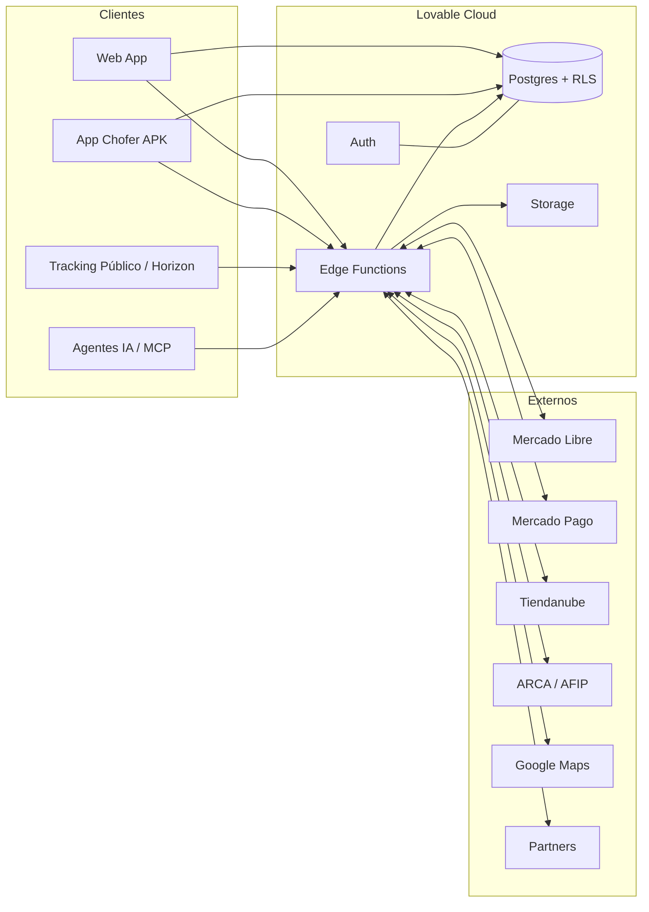
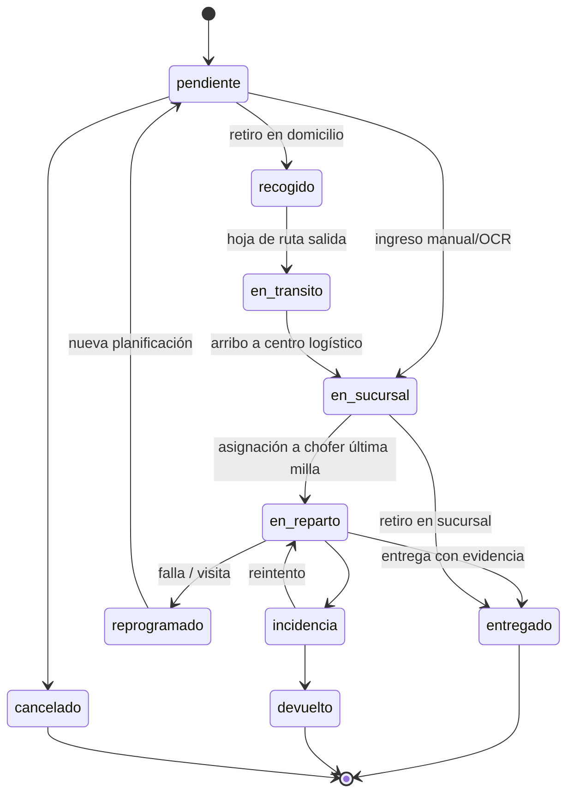
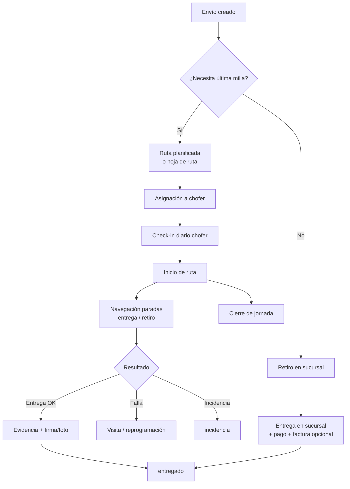
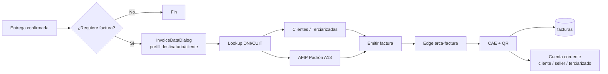
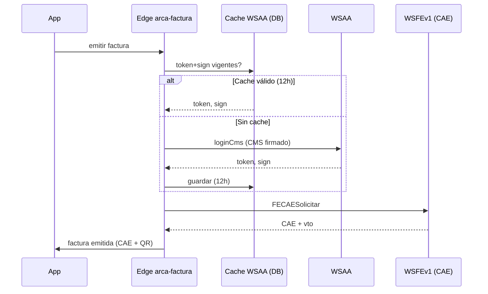
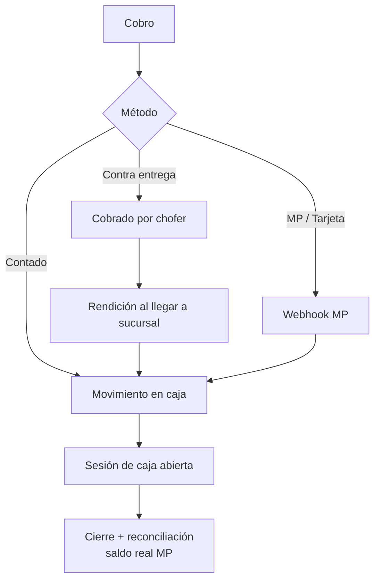
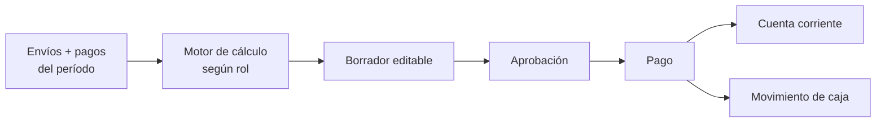
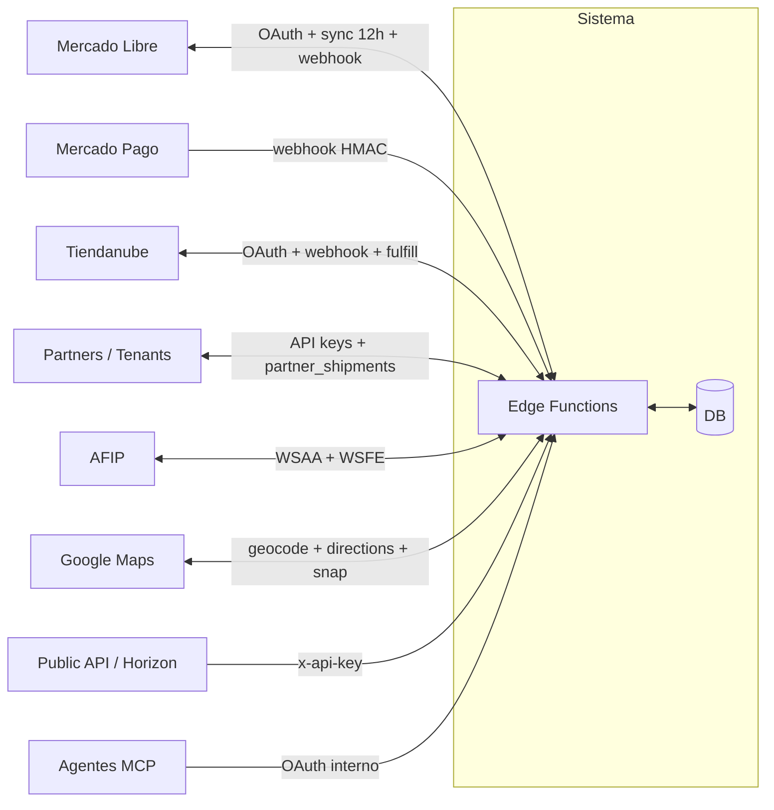
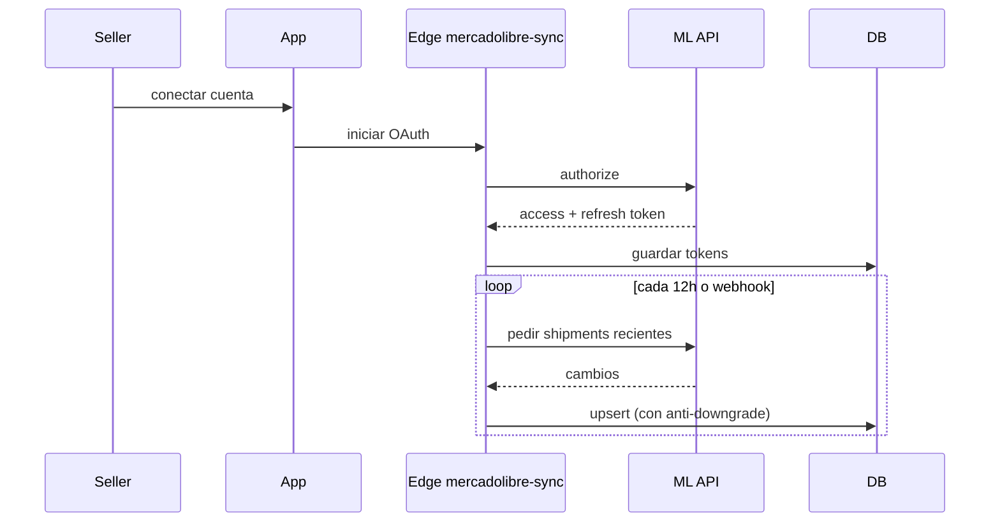
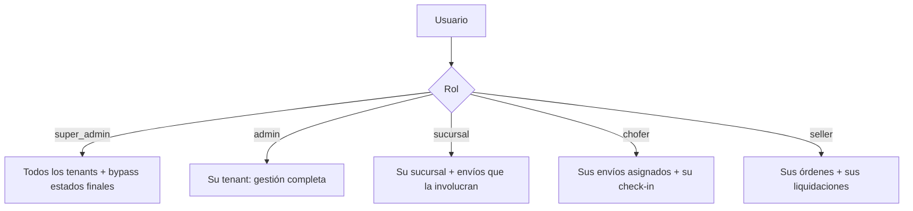

# Arquitectura y Flujos del Sistema

Documento técnico de alto nivel sobre cómo fluyen los procesos del sistema (Geologistick). Todos los diagramas son Mermaid y se renderizan directamente en el visor Markdown.

---

## 1. Panorama general

- **Frontend**: React + Vite + Tailwind + shadcn/ui. App móvil en Capacitor (Android APK) para choferes.
- **Backend**: Lovable Cloud (Supabase) — Postgres con RLS, Auth, Storage, Edge Functions (Deno).
- **Multi-tenant**: cada registro operativo lleva `tenant_id`. RLS y funciones `SECURITY DEFINER` (`current_user_tenant()`, `has_role()`) garantizan aislamiento.
- **Roles**: `super_admin`, `admin`, `chofer`, `sucursal`, `seller`. Los `super_admin` pueden operar entre tenants y revertir estados finales.
- **Integraciones**: Mercado Libre, Mercado Pago, Tiendanube, ARCA/AFIP, Google Maps/Directions, Partners federados, Public API + MCP.

### Diagrama de contexto

---

## 2. Núcleo operativo

### 2.1 Ciclo de vida del envío

Los estados **entregado / cancelado / devuelto** son finales: bloquean escaneos y ediciones (solo `super_admin` puede revertir).

### 2.2 Orígenes de creación

| Origen | Canal |
|---|---|
| Manual | Formulario web / OCR de etiqueta |
| E-commerce | Mercado Libre (webhook + sync), Tiendanube (webhook) |
| API pública | `x-api-key` de tenant, endpoints REST |
| Partner | Federación entre tenants |

### 2.3 Planificación y ejecución

Puntos clave:
- **Check-in diario obligatorio** para chofer (guarda coordenadas).
- **Reprogramación** desasigna chofer y vuelve a `pendiente` (salvo en ML, que usa `reprogramado`).
- **Trazabilidad física entre sucursales** vía hojas de ruta flex (`en_transito → en_sucursal` con `sucursal_entrega_id`).
- **GPS en vivo** con precisión máx. 50 m, polling dinámico 10/15 s; trayectorias ajustadas a calles con snap-to-roads.

---

## 3. Facturación y cobros

### 3.1 Flujo de facturación al entregar

- Tipo de comprobante A / B / C se deriva de la condición IVA del emisor vs receptor.
- Documento del receptor: 11 díg. → CUIT (80), 7–8 díg. → DNI (96), vacío → consumidor final (99/0).
- Los datos del destinatario del envío se precargan y son editables.

### 3.2 Secuencia ARCA/AFIP

### 3.3 Pagos, caja y rendiciones

- **Sesiones de caja** por sucursal; solo con sesión abierta se registran movimientos.
- **Rendición** valida montos y método, cruza pagos vs efectivo entregado.
- **Cuentas corrientes** (cliente, seller, terciarizado) actualizan saldo dinámicamente.

---

## 4. Liquidaciones

Diagrama común: todas siguen el patrón **inputs → cálculo → borrador → aprobación → pago → cuenta corriente**.

### 4.1 Por rol

| Rol | Base de cálculo | Regla clave |
|---|---|---|
| **Chofer** | Comisión por zona / tarifa activa | Excluye entregas en sucursal. Pendientes recalculan; liquidados guardan histórico. Fallback: tarifa de zona activa que matchee `ciudad_entrega`. |
| **Sucursal** | Envíos por fecha de entrega | Emisión vs recepción según sucursal. Fallback por nombre de concepto (IDs legacy). Excluye envíos ya liquidados. |
| **Seller (e-commerce)** | `saldo dinámico = envíos − pagos` | Incluye cargos de `seller_cuenta_corriente`. Tarifa: exclusiva > default > general. Excluye envíos `pendiente`. |
| **Terciarizado** | Por operación | Retiro vs entrega según `requiere_retiro`. IVA discriminado. |
| **Partner** | Acuerdo comercial | Sincronización con partner destino, comisión por `partner_comisiones`. |

### 4.2 Automatismos

- Pagar liquidación seller → crea `pago` + egreso de caja + movimiento en cuenta corriente.
- Cancelar envío liquidado → nulifica pagos y compensa en caja para preservar integridad financiera.
- Envíos cancelados con visita cuentan valor de visita; sin visita, valor $0.

---

## 5. Integraciones externas

### 5.1 Contexto de integraciones

### 5.2 Puntos clave por integración

- **Mercado Libre**: OAuth por seller, sync 12 h con anti-downgrade (no revierte a estados anteriores), estados duales (interno + ML mapeado), webhook para actualizaciones push.
- **Mercado Pago**: webhook clona el request para verificar HMAC. Cobros contra entrega, suscripciones del propio SaaS.
- **Tiendanube**: OAuth, cálculo de tarifas en checkout, fulfillment automático al despachar.
- **Partners (federación de tenants)**: `partner_shipments` con `estado_sync`; trigger propaga entregas y devoluciones entre tenants.
- **Public API**: header `x-api-key` por tenant. Sin key devuelve datos ofuscados (sin PII). Endpoints: tracking, tarifas, sucursales, live map.
- **MCP (agentes IA)**: OAuth propio, respeta RLS del usuario. Tools expuestas: `whoami`, `list_shipments`, `get_shipment`, `shipment_stats`.

### 5.3 Sincronización ML (secuencia)

---

## 6. Seguridad y multi-tenant

- **RLS activa** en todas las tablas del schema `public`, con GRANT explícito por rol (`authenticated`, `service_role`, `anon` solo donde aplica).
- **Aislamiento por tenant**: funciones `current_user_tenant()` y `user_belongs_to_tenant()` como filtro en policies.
- **Autorización**: `has_role(user, role)` sobre tabla `user_roles` (nunca en `profiles`).
- **Super_admin**: puede operar entre tenants y revertir estados finales vía diálogo controlado.
- **API keys**: hash HMAC con fallback a SHA-256 para keys legacy; validadas server-side.
- **Padrón AFIP**: certificados y claves privadas en `system_integrations` con cache de 12 h para el token WSAA.

### Modelo de acceso simplificado

---

## Anexo: convenciones

- Estados finales: `entregado`, `cancelado`, `devuelto` — bloquean escaneo/edición.
- Tracking mostrado siempre como `tracking_externo || tracking_number`.
- Coordenadas: `entrega_lat/lng` prima sobre `destinatario_lat/lng`.
- Teléfonos AR normalizados: prefijo `+54`, `15 → 9`, sin `0` de área.
- Total exacto en queries: `{ count: 'exact', head: true }` para superar el límite de 1000 filas.
